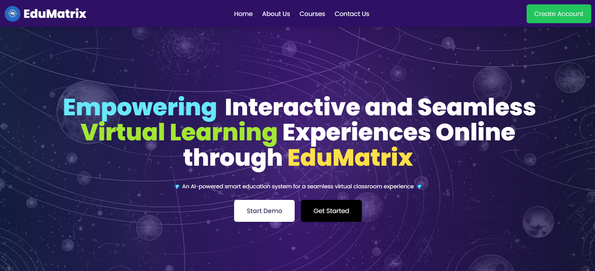

# 🎓 **EduMatrix Virtual Classroom** – _Making Virtual College for Everyone_

**Main Aim: To make all colleges run virtually and make learning accessible to everyone, anywhere!** 🌐  

EduMatrix is a **full-stack web application** designed to revolutionize online education by providing a seamless and interactive virtual classroom experience. Built using the **MERN stack** (MongoDB, Express, React, Node.js), the platform incorporates **real-time communication features** to support live classes, video conferencing, and collaborative tools like a shared whiteboard and chat.



---

## 📚 **About the Project**

The **EduMatrix Virtual Classroom** platform offers a comprehensive solution for institutions and educators to conduct classes online with minimal setup. The system provides **real-time video conferencing**, **chat**, and **interactive whiteboards** to bridge the gap between traditional classrooms and virtual learning.

---

## 🎯 **Goals**

1. **Enhance Online Education**: Create an engaging virtual learning environment for students and educators.  
2. **Accessibility**: Make quality education available globally through a reliable, easy-to-use platform.  
3. **Real-Time Interaction**: Support effective communication with tools like video conferencing and chat.  
4. **Scalability**: Build a system that can handle a large number of concurrent users.  
5. **Customization**: Allow educators to personalize the platform to suit their specific needs.

---

## 📋 **Table of Contents**

- [Features](#features)  
- [Project Structure](#project-structure)  
- [Setup Instructions](#setup-instructions)  
- [Contributing](#contributing)  
- [License](#license)

---

## ✨ **Features**

✅ **Frontend**: Built with **React**, configured with **Vite** for faster builds and optimized development.  
✅ **Backend**: Powered by **Node.js** with **Express** API server.  
✅ **Admin Panel**: A dedicated admin interface to manage users, courses, and sessions.  
✅ **Real-Time Communication**: Supports **live video conferencing** and **chat** using **WebRTC** and **Socket.IO**.  
✅ **Interactive Tools**: Includes a **shared whiteboard** for collaborative learning during classes.  
✅ **Secure Authentication**: Implements **JWT-based login** and user management.  
✅ **Responsive Design**: Works seamlessly across devices – desktops, tablets, and smartphones.

---

## 🗂 **Project Structure**

```bash
root
├── client         # Frontend (React with Vite)
├── server         # Backend (Node.js with Express)
└── admin          # Admin Panel (React with Vite)
```

### **Directory Overview**  
- **client**: Contains the user-facing frontend interface.  
- **server**: Handles the backend API logic, authentication, and database interactions.  
- **admin**: A dedicated panel for administrators to manage users, courses, and other platform settings.

---

## 🛠 **Setup Instructions**

### 📋 **Prerequisites**

Ensure you have the following installed on your machine:  
- **Node.js** (v20.9.0 or later)  
- **npm** or **yarn**

---

### 📥 **1. Clone the Repository**

```bash
git clone https://github.com/your-username/edumatrix-virtual-classroom.git
cd edumatrix-virtual-classroom
```

---

### 📦 **2. Install Dependencies**

Navigate to the respective folders and run the following commands:

#### Frontend (Client)

```bash
cd client
npm install
```

#### Backend (Server)

```bash
cd ../server
npm install
```

#### Admin Panel

```bash
cd ../admin
npm install
```

---

### 🛠 **3. Configure Environment Variables**

Create a `.env` file in the `server` and `admin` directories with the required environment variables.

Example `.env` file for the server:

```env
MONGO_URI=your_mongo_db_uri
JWT_SECRET=your_jwt_secret
FRONTEND_URL=http://localhost:5173
ADMIN_URL=http://localhost:5174
```

---

### ▶️ **4. Start the Application**

#### Backend Server

From the `server` folder:

```bash
npm run dev
```

#### Frontend Server (Client)

From the `client` folder:

```bash
npm run dev
```

#### Admin Panel

From the `admin` folder:

```bash
npm run dev
```

---

### 🌐 **5. Access the Application**

- **Frontend (User)**: [http://localhost:5173](http://localhost:5173)  
- **Admin Panel**: [http://localhost:5174](http://localhost:5174)  

---

## 🤝 **Contributing**

We welcome contributions to improve EduMatrix! 🛠️

### Steps to Contribute

1. **Fork the repository** and clone it to your local machine.  
2. **Create a new branch** for your feature or bug fix:  
   ```bash
   git checkout -b feature/new-feature
   ```  
3. **Commit your changes** with a clear message:  
   ```bash
   git commit -m "Added a new feature for admin management"
   ```  
4. **Push to your fork** and open a **pull request**:  
   ```bash
   git push origin feature/new-feature
   ```  

---

## 💡 **Development Guidelines**

- Ensure **code consistency** using **ESLint** and **Prettier**.  
- Write **clear and concise commit messages**.  
- **Test your changes** before submitting a pull request.  

---

## 📜 **License**

This project is licensed under the **Apache License 2.0**. See the [LICENSE](LICENSE) file for more details.

---

## 🎉 **Let’s Make Virtual Learning Accessible for All!**

Thank you for contributing to EduMatrix Virtual Classroom! Together, we can revolutionize the way education is delivered. 🚀

---
